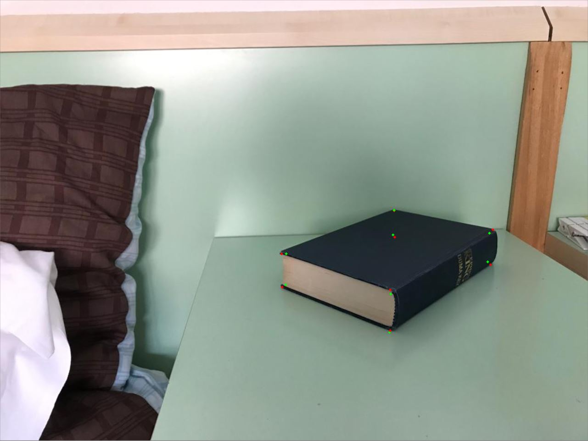
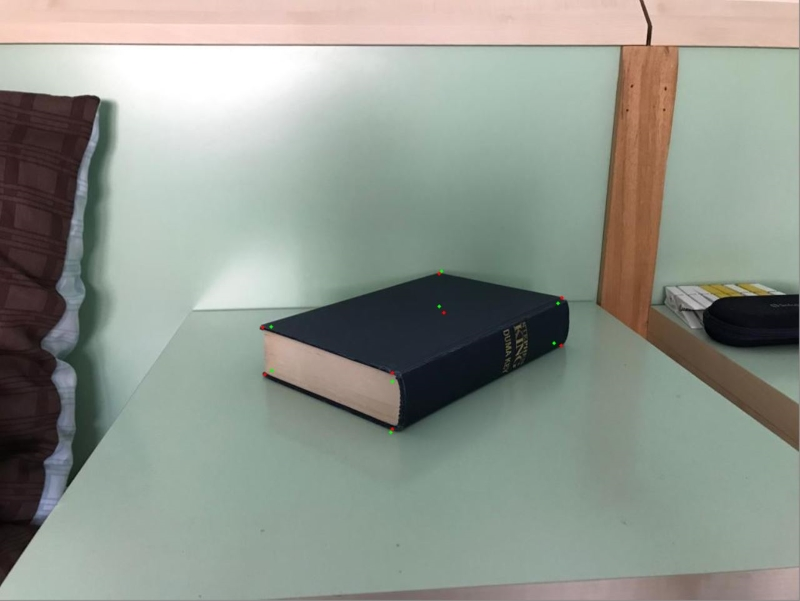

# Exterior Orientation Estimation

The script exterior_orientation estimation implements a function to estimate the external parameters (Rotation R and Translation t)
from a scene given 2D to 3D corresponding points and the matrix K of internal parameters. The script performs the parameter estimation
for two different scenes and in the end projects the given 3D points back onto each the scene:  

Red dots represent the initially known corresponding points, while green dots are the reprojection using the estimated parameters.

## First Scene

## Second Scene

