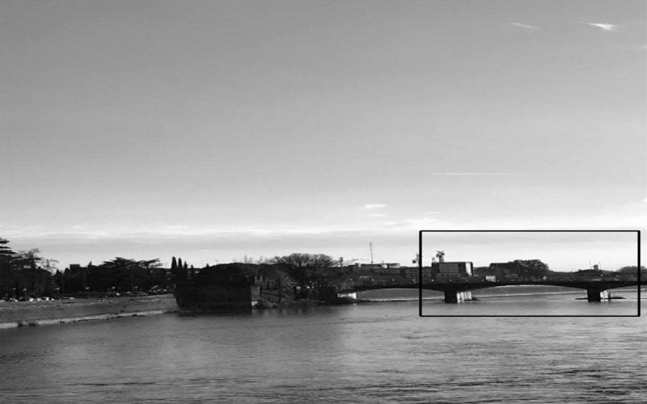
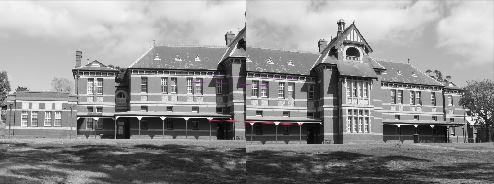

# Image Mosaicing

The script image_mosaicing.py implements a function to estimate the homography giving the relationship between
a planar scene shown in two images, given a set of corresponding points. It also implements the direct/inverse
transformation to transform the pixels from one view into the other and to create a stitched/combined Mosaic Image.  

## Original Images and corresponding Points

The script uses ORB keypoint detector to detect and match keypoints in the images. The locations of the detected
keypoints has an influence of the quality of the stitching, so the user can specify a rectangle from which keypoints
should be taken.

## Mosaic Image

Once the homography H has been estimated, the right image's pixel coordinates can be transformed to the left image
and the mosaic image can be obtained.

## Notes

Estimating the homography needs 8 linear independent equations. Each point correspondence provides 2 of these equations.
But points, that are very close to each other, or share almost the same x or y coordinate, will provide no or only 1 valuable
equation to the equation system. Missing one or more valuable equations can lead to a large error regarding the estimation of
the homography.

