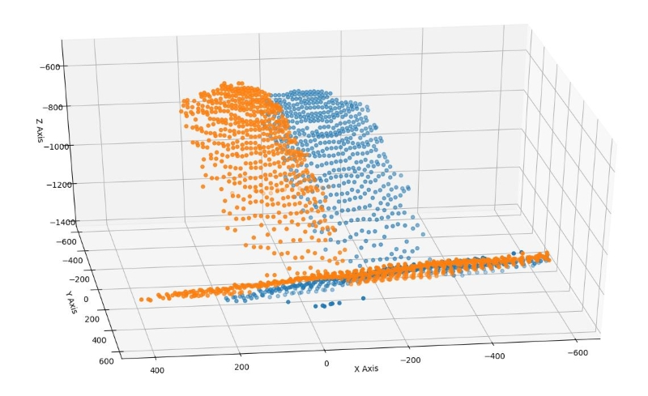
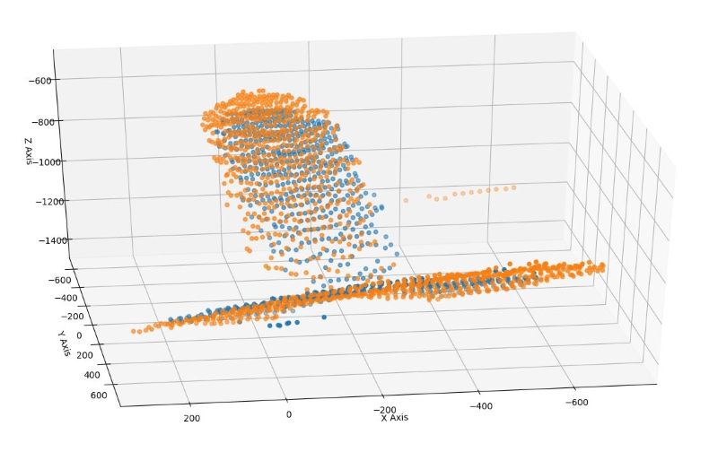

# Iterative Closest Point

The script iterative_closest_point.py implements a function to perform ICP for two
given sets of 3D data points.

## Initial data

## Transformed data after 50 iterations

