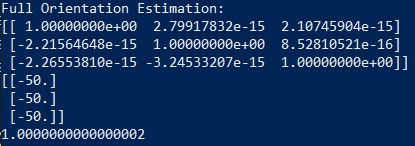

# Iterative Closest Point

The script iterative_closest_point.py implements a function to perform ICP for two
given sets of 3D data points. This includes applying a rigid transformation on a dataset
to match it optimally to another dataset. The estimated full transformation 
(Scaling, Rotation, Translation) is returned.

## Initial data

## Transformed data after 50 iterations

## Estimated Transformation (Different data)

The shown estimated transformation belongs to a pair of datasets, of which
one was the exact copy of the other one with an added shift (translation)
of 50 along all axes, and no Rotation/Scaling. This was correctly estimated by the algorithm:

Rotation -> Identity
Translation -> -50 for all axes
Scale -> 1

