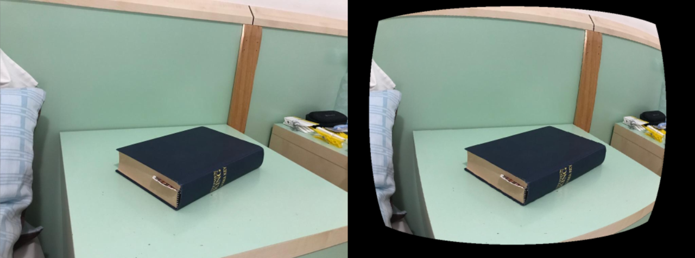
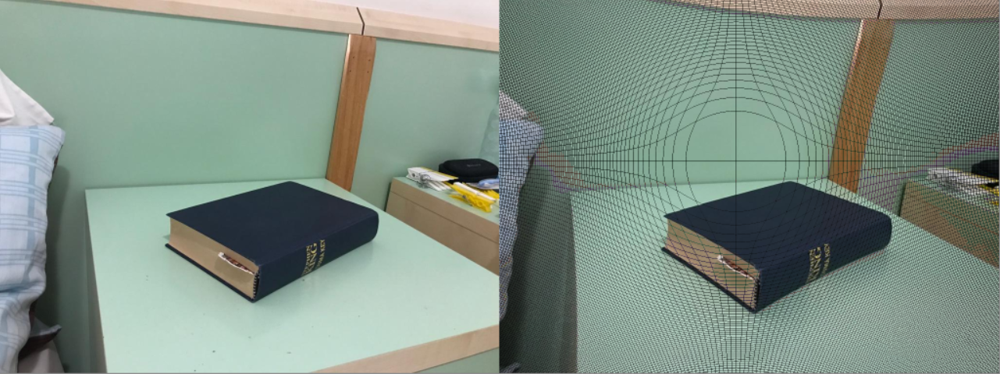

# Radial Distortion

The script radial_distortion.py creates distorted images from given input images.
The distortion is generated by a radial distortion model using a single parameter K1.
For parameter values K1 smaller than 0, the model creates pincushion distortion,
while for parameter values K1 greater than 0 it creates barrel distortion.

## Example 1 Pincushion Distortion, K1 = -0.4

## Example 2 Barrel Distortion, K1 = 0.7

