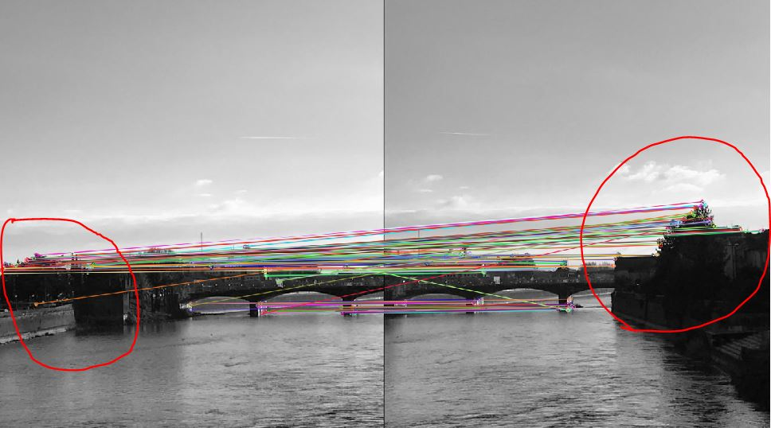

# RANSAC (Random Sample Consensus)

The script ransac.py implements a function that performs image mosaicing
through homography estimation in combination with the RANSAC method for
outlier detection. 

## Corresponding Points

The corresponding points in this example are not preprocessed and filtered.
Therefore, there are a lot of false matches.

## Mosaicing on RANSAC-filtered keypoints

While the standard mosaicing procedure fails on datapoints
containing a large amount of outliers, the RANSAC method performs much better
and is often able to detect the outliers. As RANSAC is a stochastic method,
there is no guarantee that the outliers are found correctly, but given
a sufficient number of sampling iterations, the probability is high.