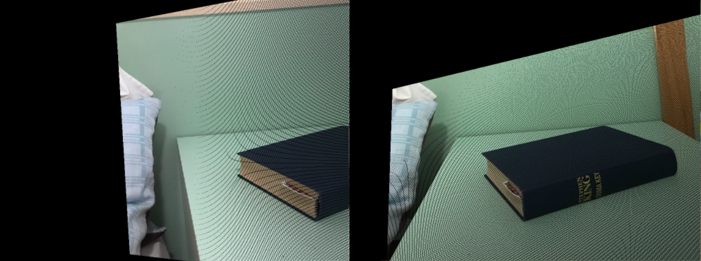
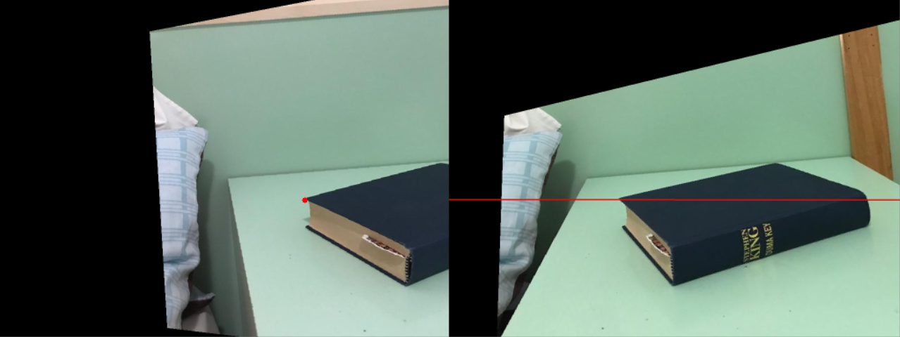

# Image Rectification

## Tasks

1. Implement the image rectification and show that now epipolar lines are parallel and horizontal.

## Solutions

1. The script rectification.py implements a function to construct two rectified perspective matrices given two arbitrary perspective matrices. The obtained transformation can then be used either with the direct or inverse transformation method to rectify an image. Transformed coordinates are clipped to match the image dimensions.

### Rectification Direct Transform

The direct transform shows pixels that did not get assigned a pixel value. Their pixel value has to be obtained, e.g. using interpolation, in a further processing step.

### Rectification Inverse Transform

The inverse transformation has the characteristic that every point in the rectified image got a pixel value assigned (though if the transformed coordinate of a pixel lies outside of the original images boundary, there is no way to select a meaningfull pixel value).

### Epipolar Line on Rectified Images

The plot shows a horizontal epipolar line, which has the same y coordinate as the corresponding point that generated it.
